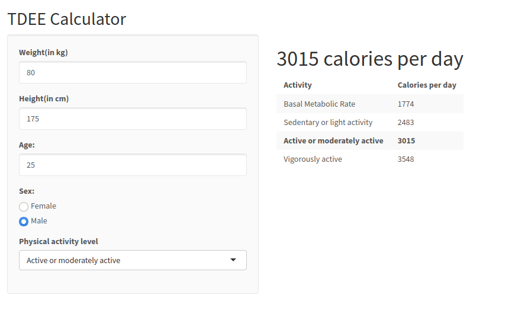

# Total Daily Energy Expenditure (TDEE) Calculator

This project is a TDEE calculator written in the R programming language using the Shiny package.



The calculator uses the [Harris-Benedict equations](https://pubmed.ncbi.nlm.nih.gov/2305711/) reviewed by Mifflin and St Jeor in 1990 and the levels of [physical activity levels](http://www.fao.org/3/y5686e/y5686e07.htm) in the recommendations of the report Human energy requirements of the Food and Agriculture Organization of the United Nations.

## Getting Started

### Set port number
```sh
export PORT=8080
```

### Run app

```sh
R -f app.R
```

## Deploy in IBM Cloud Foundry

```sh
# Install Cloud Foundry plugin
ibmcloud cf install

# Log in to your IBM Cloud account
ibmcloud login

# Target a Cloud Foundry org and space
ibmcloud target --cf

# Push app
ibmcloud cf push
```
